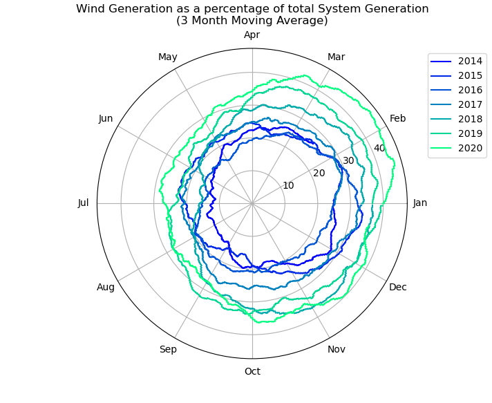

# EirgridDashboardAnalysis

Eirgrid's Smart Grid Dashboard provides data on Ireland's electricity grid. The dashboard can be viewed <a href="http://smartgriddashboard.eirgrid.com/" target="blank">here</a>.

This repo contains scripts to:

<ul>
  <li>automatically download data;</li>
  <li>analyse downloaded data;</li>
</ul>

 The following plots show examples of the analysis that can be implemented: 

 

Calculation of the annual average contribution of generated wind energy to overall generated energy from 2014 to 2020:

 

Calculation of the monthly average contribution of wind generation to overall system generation from 2014 to 2020, with smoothing applied using a three month moving average:

